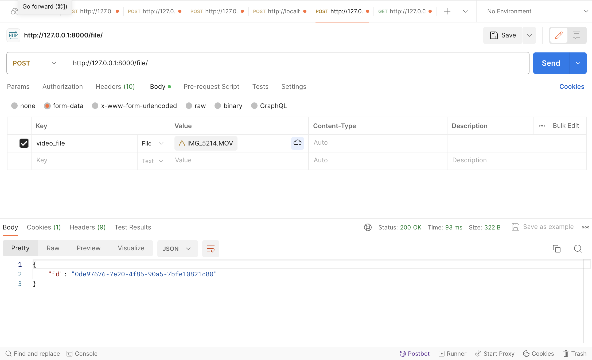
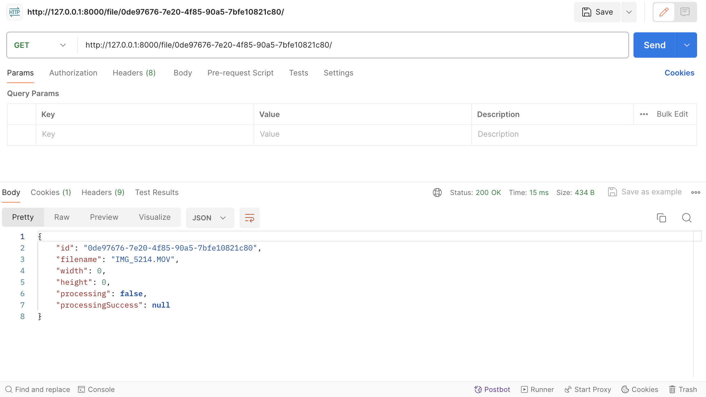
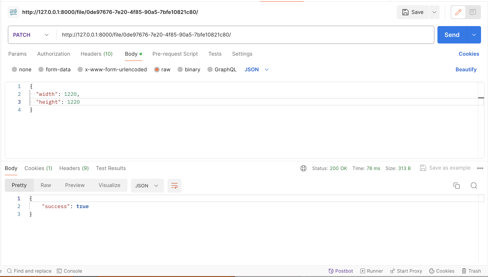
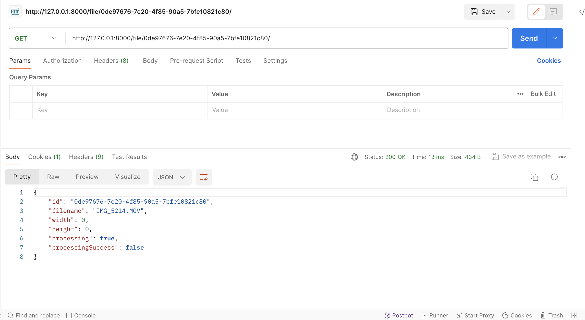
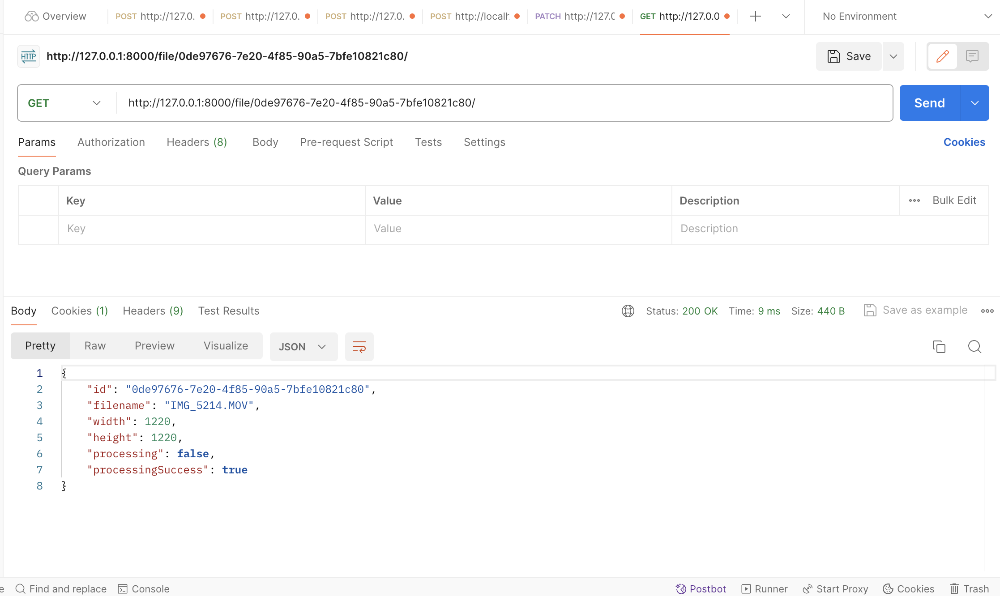
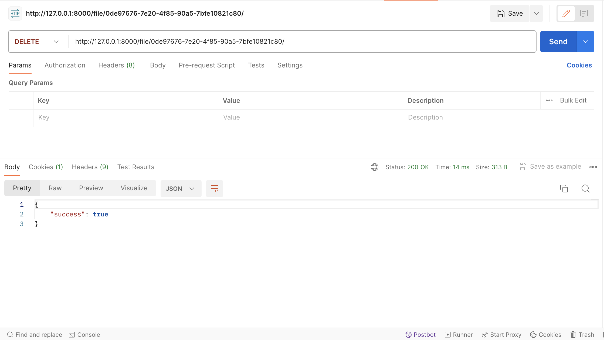

# API для сервиса хранения видеофайлов с возможностью менять разрешение. #

## Стек технологий ##
+ Django
+ Celery
+ ffmpeg

## Как запустить проект
Клонируйте репозиторий и перейдите в него в командной строке:
```
git clone git@github.com:Mary8jk/test-mmvs.git
```

```
cd test-mmvs
```

Cоздайте и активируйте виртуальное окружение:

```
python3 -m venv venv
```

```
source venv/bin/activate
```

Установите зависимости из файла requirements.txt:

```
python3 -m pip install --upgrade pip
```

```
pip install -r requirements.txt
```

Выполняем миграции:

```
python3 manage.py migrate
```

Устанавливаем Redis:

```
brew install redis
```

Запускаем Redis, как службу:

```
brew services start redis
```

Проверяем статус Redis:

```
brew services list
```

Для запуска Celery выполним в отдельном терминале команду из диретории /backend:

```
DJANGO_SETTINGS_MODULE=backend.settings celery -A video_service worker -l info
```

Для запуска сервера Django выполним из дериктории /backend:

```
python3 manage.py runserver
```


## В ходе разработки реализовано: ##
- Метод POST /file/:

- Метод GET (сразу после POST-запроса) /file/{id}/:

- Метод PATCH /file/{id}/:

- Метод GET (во время процесса изменения разрешения видео с помощью PATCH-запроса) /file/{id}/:

- Метод GET (после завершения процесса изменения разрешения видео с помощью PATCH-запроса) /file/{id}/:

- Метод DELETE /file/{id}/:



